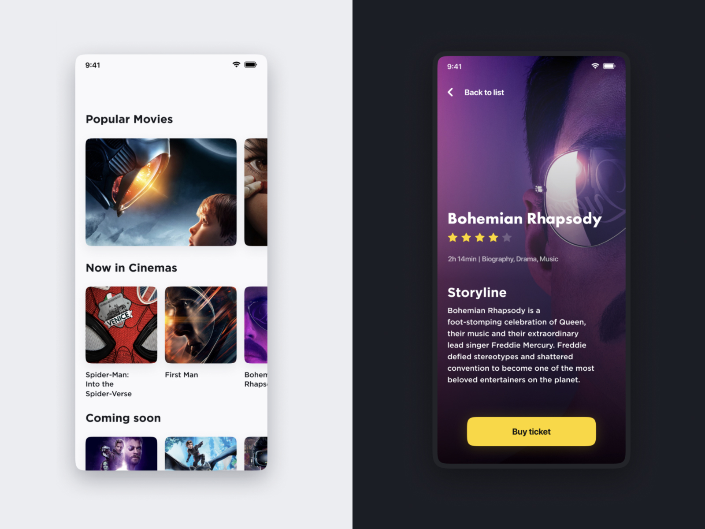

# nomadcoder_challenges

Movieflix

- 엡은 2개 화면이 있어야 합니다: Home 그리고 Detail.
- Home 스크린은 아래와 같은 기능을 갖고있어야 합니다.
    -  가장 인기 있는 영화 목록이 표시되어야 합니다.
    - 극장에서 상영 중인 영화 목록이 표시되어야 합니다.
    - 곧 개봉할 영화 목록이 표시되어야 합니다.
- movie를 탭하면 세부정보 화면으로 이동해야 합니다.
- 세부정보 화면에는 다음이 표시되어야 합니다.
    - 영화의 포스터.
    - 영화의 제목.
    - 영화의 등급.
    - 영화의 개요.
    - 영화의 장르.
가장 인기 있는 영화를 보려면 이 엔드포인트를 방문하세요: https://movies-api.nomadcoders.workers.dev/popular
극장에서 상영 중인 영화를 보려면 이 엔드포인트를 방문하세요: https://movies-api.nomadcoders.workers.dev/now-playing
곧 개봉하는 영화를 보려면 이 엔드포인트를 방문하세요: https://movies-api.nomadcoders.workers.dev/coming-soon
영화에 대한 세부 정보를 보려면 이 엔드포인트를 방문하세요: https://movies-api.nomadcoders.workers.dev/movie?id=1 (아이디를 세부 정보를 보려는 영화의 아이디로 바꾸세요).

## Notes.
영화 데이터베이스에서 이미지를 표시할 때는 https://image.tmdb.org/t/p/w500/ + 이미지 경로와 같은 URL을 사용해야 합니다.
예를 들어 이미지 경로가 "/vZloFAK7NmvMGKE7VkF5UHaz0I.jpg"인 경우 전체 URL은 https://image.tmdb.org/t/p/w500/vZloFAK7NmvMGKE7VkF5UHaz0I.jpg 입니다.
